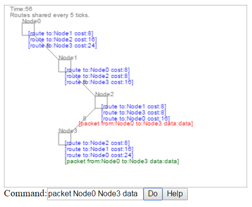

NetworkSimulator
================

A rudimentary computer network simulator implemented in JavaScript.

As of this writing, it only simulates route determination using the Bellman-Ford algorithm on a statically defined network.  But it is intended to someday expand it to simulate other aspects and protocols of networking, like noisy links and TCP/IP.